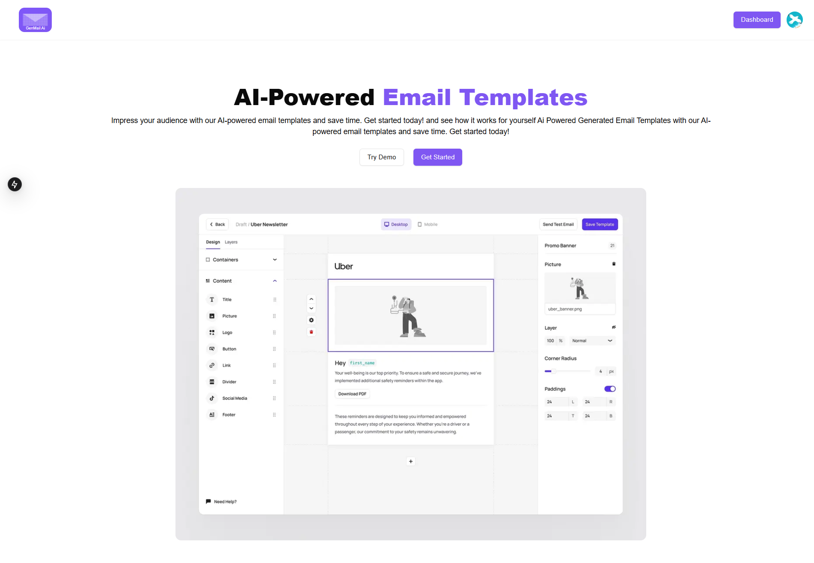

# 🚀 GenMail-AI: ✨ Craft Stunning Emails with AI Magic! 📧

[](https://gen-mail-ai.vercel.app/)
<p align="center">
  <a href="#">
    
  </a>
</p>

<div align="center">
  ✨ <strong>Unleash the power of AI to design captivating email templates effortlessly!</strong> ✨
</div>
<br/>

👋 Welcome to **GenMail-AI**, your creative co-pilot for crafting awesome email templates! Forget tedious design work – with GenMail-AI, you can generate unique and engaging email templates powered by the magic of artificial intelligence. 🪄

This project is built with Next.js and leverages AI to streamline your email design process. Whether you're a marketing guru, a startup founder, or just someone who wants to send beautiful emails, GenMail-AI is here to help you level up your email game! ⬆️

## 💖 Support & Donations

If you find CodeMind AI helpful and would like to support its development, you can make a donation:

- **PayPal**: [mnasserone@gmail.com](mailto:mnasserone@gmail.com)

Your support is greatly appreciated and helps us continue to improve and maintain the project.

## ✨ Key Features That Sparkle ✨

*   **🧠 AI-Powered Template Generation:**  Describe your desired email, and let our AI whip up a stunning template for you! Just provide a prompt and watch the magic happen. ✨
*   **🎨 Drag & Drop Canvas:**  Tired of coding emails from scratch? Our intuitive drag-and-drop canvas makes customization a breeze.  Simply pick elements and arrange them to your heart's content. 🖱️
*   **🧱 Modular Components:**  Mix and match pre-built components like headers, heroes, text blocks, buttons, images, and social icons to create your perfect email structure. 🧩
*   **⚙️ Real-time Customization:**  Fine-tune every detail with our settings panel. Adjust colors, fonts, spacing, and more to match your brand perfectly. 🖌️
*   **📱 Mobile-Responsive Design:**  Ensure your emails look fantastic on every device! GenMail-AI templates are designed to be responsive and adapt to different screen sizes. 🤳
*   **💻 Desktop & Mobile Preview:**  See exactly how your email will appear on both desktop and mobile before you send it out. 👀
*   **💾 Save & Manage Templates:**  Create a library of your favorite email templates for future use. Organize and reuse your designs with ease. 🗂️
*   **✂️ Start from Scratch Option:**  Feeling creative? You can always start with a blank canvas and build your template element by element. 🚀
*   **📄 View HTML Code:**  For the tech-savvy users, you can view and copy the generated HTML code of your template. 🤓

## 🛠️ Tech Stack - Built with Love & Cutting-Edge Tools 💖

*   **Next.js:**  For a blazing-fast and SEO-friendly React framework. ⚛️
*   **React:**  For building a dynamic and interactive user interface. 💡
*   **Tailwind CSS:**  For styling with utility-first classes and making it look awesome. 🎨
*   **Radix UI:** For accessible and unstyled UI primitives that are highly customizable. 💎
*   **Convex:** For a reactive backend that keeps your data in sync. ☁️
*   **Google Gemini AI API:** The brains behind the AI-powered template generation! 🤖
*   **OAuth 2.0 (Google Sign-In):** Secure and easy user authentication. 🔑
*   **Sonner:** For delightful and unobtrusive toast notifications. 🔔

## 🚀 Get Ready to Email Like a Pro! -  Local Development ⚙️

Want to run GenMail-AI on your local machine and contribute to the project? Here's how:

1.  **Clone the Repository:**

    ```bash
    git clone https://github.com/nasserml/GenMail-AI.git 
    cd GenMail-AI
    ```

2.  **Install Dependencies:**

    ```bash
    npm install # or yarn install or pnpm install or bun install
    ```

3.  **Set up Environment Variables:**

    *   Create a `.env.local` file in the root directory.
    *   Add your Convex URL and Google Client ID. You'll need to set up a Convex project and Google Cloud credentials.  (Refer to Convex and Google Cloud documentation for detailed steps).

        ```env
        NEXT_PUBLIC_CONVEX_URL=YOUR_CONVEX_URL
        NEXT_PUBLIC_GOOGLE_CLIENT_ID=YOUR_GOOGLE_CLIENT_ID
        NEXT_PUBLIC_GEMINI_API_KEY=YOUR_GEMINI_API_KEY # Get your Gemini API key from Google AI Studio
        ```

4.  **Run the Development Server:**

    ```bash
    npm run dev # or yarn dev or pnpm dev or bun dev
    ```

    Open your browser and navigate to [http://localhost:3000](http://localhost:3000) to see GenMail-AI in action! 🎉

## 📂 Dive into the Directory Structure 🌳

Let's take a quick tour of the project's file structure:

```
nasserml-genmail-ai/
├── README.md                 # 👋 You are here!
├── components.json           # ⚙️ Shadcn UI component configuration
├── jsconfig.json             # ☕ JavaScript configuration
├── next.config.mjs           # 🚀 Next.js configuration
├── package.json              # 📦 Project dependencies and scripts
├── postcss.config.mjs        # 🎨 PostCSS configuration
├── tailwind.config.mjs       # 🖌️ Tailwind CSS configuration
├── Data/                     # 💾 Static data for layouts and elements
│   ├── ElementList.jsx       # 📝 List of email elements (Button, Text, Image etc.)
│   ├── Layout.jsx            # 🧱 Predefined email layouts (1 Column, 2 Column etc.)
│   └── Prompt.jsx            # 🗣️ Prompts for AI template generation
├── app/                      # 🚀 Next.js app directory
│   ├── globals.css           # 💅 Global CSS styles
│   ├── layout.js             # 🏠 Root layout for the app
│   ├── page.js               # 🏠 Homepage of the application
│   ├── provider.js           # ⚙️ Context providers for app-wide state management
│   ├── (main)/               # ➡️ Main application routes (dashboard, editor)
│   │   ├── dashboard/        # 📊 Dashboard pages
│   │   │   ├── layout.jsx    # 📊 Dashboard layout
│   │   │   ├── page.jsx      # 📊 Dashboard main page
│   │   │   └── create/       # ✨ Create new template page
│   │   │       └── page.jsx  # ✨ Create new template page content
│   │   └── editor/          # 📝 Email template editor
│   │       └── [templateId]/ # 📝 Dynamic route for template editor (based on template ID)
│   │           └── page.jsx  # 📝 Email template editor page content
│   └── api/                  # 🌐 API routes for backend functionality
│       └── ai-email-generate/ # 🤖 API route for AI email template generation
│           └── route.jsx     # 🤖 API route handler
├── components/               # 🧩 Reusable React components
│   ├── LayoutElements/       # 🧱 Layout components (ColumnLayout)
│   │   └── ColumnLayout.jsx  # 🧱 Column layout component
│   ├── custom/               # ✨ Custom components specific to the application
│   │   ├── AIInputBox.jsx    # 🤖 Input box for AI prompt
│   │   ├── Canvas.jsx        # 🎨 Drag and drop canvas for email design
│   │   ├── EditorHeader.jsx  # 📝 Header for the email editor
│   │   ├── ElementLayoutCard.jsx # 🧱 Card component for layout/element selection
│   │   ├── ElementsSideBar.jsx # 🧱 Sidebar for elements and layouts
│   │   ├── EmailTemplateList.jsx # 📝 List of user's email templates
│   │   ├── Header.jsx        # 🏠 Main header component
│   │   ├── Hero.jsx          # 🦸 Hero section for the homepage
│   │   ├── Settings.jsx      # ⚙️ Settings panel for element customization
│   │   ├── SignInButton.jsx  # 🔑 Sign-in with Google button
│   │   ├── ViewHtmlDialog.jsx # 📄 Dialog to view HTML code
│   │   ├── Element/          # ✨ Individual email elements (Button, Text, Image etc.)
│   │   │   ├── ButtonComponent.jsx     # 🔘 Button element
│   │   │   ├── DividerComponent.jsx    # ➖ Divider element
│   │   │   ├── ImageComponent.jsx      # 🖼️ Image element
│   │   │   ├── LogoComponent.jsx       # 🏢 Logo element
│   │   │   ├── LogoHeaderComponent.jsx # 🏢 Logo Header element
│   │   │   ├── SocialIconsComponent.jsx # 🔗 Social Icons element
│   │   │   └── TextComponent.jsx       # 📝 Text element
│   │   └── Settings/         # ⚙️ Setting fields for customization
│   │       ├── ColorPickerField.jsx   # 🎨 Color picker field
│   │       ├── DropDownField.jsx      # 🔽 Dropdown field
│   │       ├── ImagePreview.jsx     # 🖼️ Image preview field
│   │       ├── InputField.jsx       # ⌨️ Input field
│   │       ├── InputStyleField.jsx  # 📏 Input field for styles (with units)
│   │       ├── SliderField.jsx      # 🎚️ Slider field
│   │       ├── TextAreaField.jsx    # 📝 Textarea field
│   │       └── ToggleGroupField.jsx # 🔘 Toggle group field
│   └── ui/                   # 💎 Shadcn UI components
│       ├── button.jsx          # 🔘 Button UI component
│       ├── dialog.jsx          # 💬 Dialog UI component
│       ├── input.jsx           # ⌨️ Input UI component
│       ├── select.jsx          # 🔽 Select UI component
│       ├── separator.jsx       # ➖ Separator UI component
│       ├── sheet.jsx           # 📄 Sheet UI component
│       ├── sidebar.jsx         # ⬅️ Sidebar UI component
│       ├── skeleton.jsx        # 💀 Skeleton UI component
│       ├── slider.jsx          # 🎚️ Slider UI component
│       ├── sonner.jsx          # 🔔 Sonner toast component
│       ├── tabs.jsx            # Tabs UI component
│       ├── textarea.jsx        # 📝 Textarea UI component
│       ├── toggle-group.jsx    # 🔘 Toggle group UI component
│       ├── toggle.jsx          # 🔘 Toggle UI component
│       └── tooltip.jsx         # ℹ️ Tooltip UI component
├── config/                   # ⚙️ Configuration files
│   └── AiModel.jsx           # 🤖 Configuration for the AI model (Gemini)
├── context/                  # ⚙️ React Contexts for state management
│   ├── DragDropLayoutElement.jsx # 🧱 Context for drag and drop layout element
│   ├── EmailTemplateContext.jsx # 📧 Context for email template data
│   ├── ScreenSizeContext.jsx   # 📱 Context for screen size (desktop/mobile)
│   ├── SelectedElementContext.jsx # ⚙️ Context for currently selected element
│   └── UserDetailContext.jsx     # 👤 Context for user details
├── convex/                   # ☁️ Convex backend functions and schema
│   ├── emailTemplate.js      # 📧 Convex functions for email templates
│   ├── schema.js             # ☁️ Convex database schema definition
│   ├── users.js              # 👤 Convex functions for user management
│   └── _generated/           # ⚠️ Auto-generated Convex files (do not edit)
│       ├── api.d.ts          # ⚠️ Auto-generated API type definitions
│       ├── api.js            # ⚠️ Auto-generated API client
│       ├── dataModel.d.ts    # ⚠️ Auto-generated data model type definitions
│       ├── server.d.ts       # ⚠️ Auto-generated server type definitions
│       └── server.js         # ⚠️ Auto-generated server functions
├── hooks/                    # 🎣 Custom React hooks
│   └── use-mobile.jsx        # 📱 Hook to detect mobile screen size
├── lib/                      # 📚 Utility functions and helpers
│   └── utils.js              # 🛠️ Utility functions (e.g., class name merging)
└── public/                   # 🌐 Public assets (images, fonts etc.)
```

## 🤝 Contributing - Let's Build Awesome Together! 🌟

Contributions are what make the open-source community such an amazing place to learn, inspire, and create. Any contributions you make are **greatly appreciated**.

If you have a suggestion that would make this better, please fork the repo and create a pull request. You can also simply open an issue with the tag "enhancement".
Don't forget to give the project a star! Thanks again! ⭐

1.  Fork the Project
2.  Create your Feature Branch (`git checkout -b feature/AmazingFeature`)
3.  Commit your Changes (`git commit -m 'Add some AmazingFeature'`)
4.  Push to the Branch (`git push origin feature/AmazingFeature`)
5.  Open a Pull Request

## 🙏 Acknowledgements

- **Inspired by TubeGuruji's Email Template**: Our heartfelt thanks to the incredible [Email Template project](https://www.youtube.com/watch?v=hCSX5zSb3b4&t=413s), which served as significant inspiration for GEnMAil AI.

- **Amazing Technologies and Tools**: Gratitude to Next.js, Convex, Google Generative AI, Sandpack, Tailwind CSS, and all the other technologies that make this project possible.

- **The Open Source Community**: A big thank you to the broader open-source community for your contributions, support, and spirit of collaboration.


## 📜 License

This project is open-source and available under the [MIT License](LICENSE).

##  📬 Connect & Say Hello! 👋

[Your Name/Organization] - [Link to your Website/Portfolio] - [Your Email]

[Link to your Twitter](Your Twitter Link) - [Link to your LinkedIn](Your LinkedIn Link) - [Link to your Project Website]

**Let's revolutionize email creation together!** ✨ Happy designing! 📧
